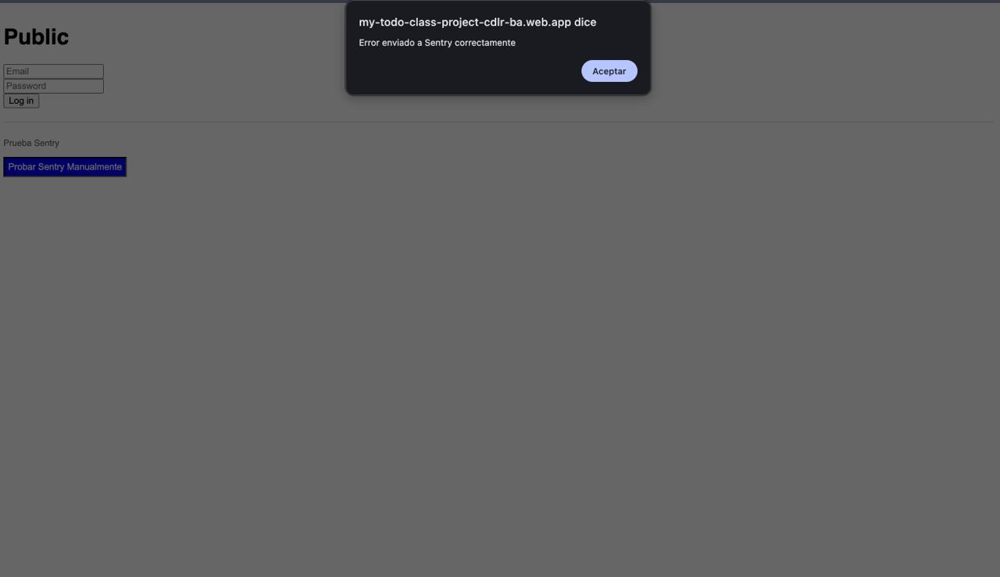
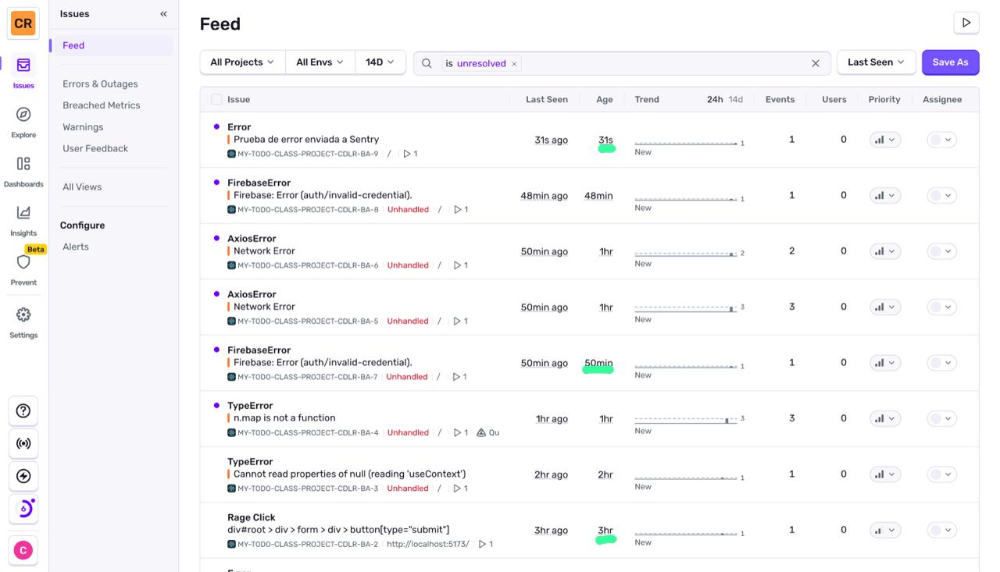
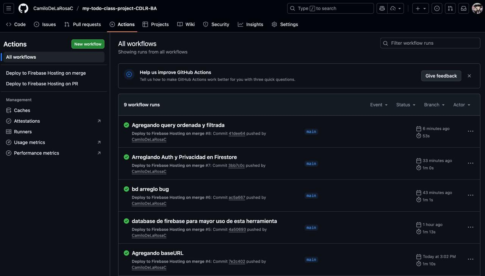
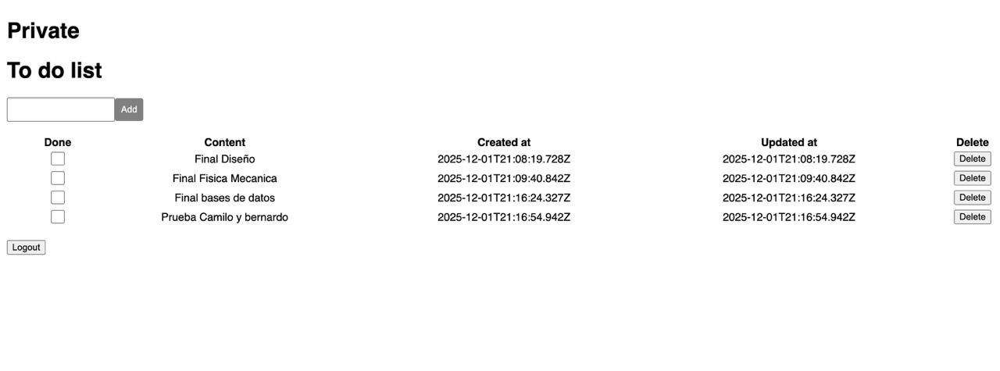
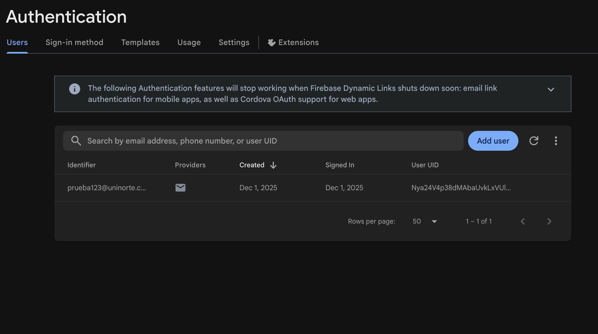
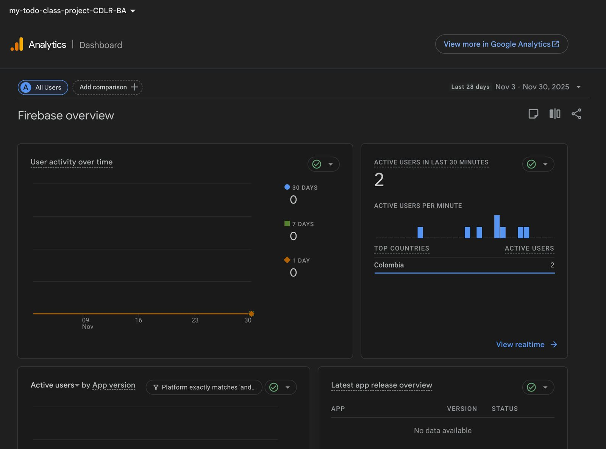

# React + TypeScript + Vite + Jest

This template provides a minimal setup to get React working in Vite with HMR and some ESLint rules.

Currently, two official plugins are available:

- [@vitejs/plugin-react](https://github.com/vitejs/vite-plugin-react/blob/main/packages/plugin-react) uses [Babel](https://babeljs.io/) for Fast Refresh
- [@vitejs/plugin-react-swc](https://github.com/vitejs/vite-plugin-react/tree/main/packages/plugin-react-swc) uses [SWC](https://swc.rs/) for Fast Refresh

## Expanding the ESLint configuration

If you are developing a production application, we recommend updating the configuration to enable type-aware lint rules:

```js
export default tseslint.config([
  globalIgnores(['dist']),
  {
    files: ['**/*.{ts,tsx}'],
    extends: [
      ...tseslint.configs.recommendedTypeChecked,
      ...tseslint.configs.strictTypeChecked,
      ...tseslint.configs.stylisticTypeChecked,
    ],
    languageOptions: {
      parserOptions: {
        project: ['./tsconfig.node.json', './tsconfig.app.json'],
        tsconfigRootDir: import.meta.dirname,
      },
    },
  },
])
```

You can also install [eslint-plugin-react-x](https://github.com/Rel1cx/eslint-react/tree/main/packages/plugins/eslint-plugin-react-x) and [eslint-plugin-react-dom](https://github.com/Rel1cx/eslint-react/tree/main/packages/plugins/eslint-plugin-react-dom) for React-specific lint rules:

```js
// eslint.config.js
import reactX from 'eslint-plugin-react-x'
import reactDom from 'eslint-plugin-react-dom'

export default tseslint.config([
  globalIgnores(['dist']),
  {
    files: ['**/*.{ts,tsx}'],
    extends: [
      reactX.configs['recommended-typescript'],
      reactDom.configs.recommended,
    ],
    languageOptions: {
      parserOptions: {
        project: ['./tsconfig.node.json', './tsconfig.app.json'],
        tsconfigRootDir: import.meta.dirname,
      },
    },
  },
])
```

## 1. Implementar una herramienta de observabilidad para captura de errores
Aqui se ve el boton azul de "probar sentry manualmente" que es el boton de pruebas que nos manda el error


En esta imagen se ven varios errores que mostraba en su desarrollo y ejecución



## 2. Implementar el deploy automático en Firebase a través de una plataforma de CI.
Deploy automatico
Para mayor uso de la herramienta usamos firebase database


Imagen de Prueba:


Autentificacion con firebase



## 3. Capturar las analíticas de la app con Google Analytics

